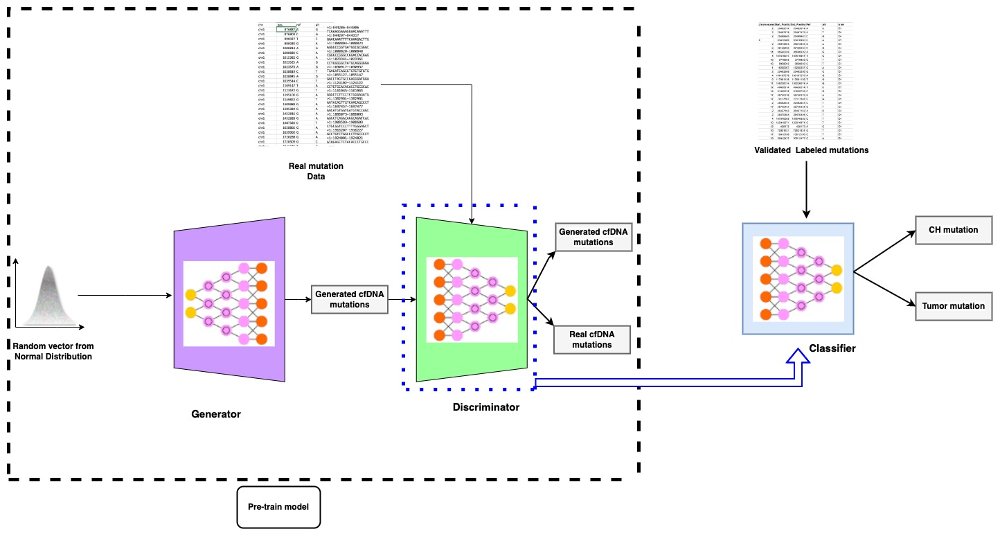

# Semi-Supervised GAN (SSGAN) for somatic-mutation-labeling

## Guide
In the current research, we have developed a generative model-based tool for simulating the cfDNA SNVs and labeling each real cfDNA SNVs as a tumor or CH. For this aim the real cfDNA NGS data which can be WGS, WES, and targeted sequencing will go under somatic variant calling with any proposed best practices, especially the one that is implemented by GATK and then the raw VCF files will be filtered based on the criteria that are explained in our manuscript. Next, the genomic coordination along with the nucleotide composition information will be extracted and used for training the GAN part of our model.
For the labeling part of our model, we have collected the validated tumor or CH-related variants from several databases and articles, and the same feature vector was prepared for each of them and fed to our semi-supervised part of our model.

## Repository Navigation Guide

### Code
•	SSGAN: A repository dedicated to training and validating SSGAN for somatic mutation labeling using both labeled and unlabeled data.
•	Preprocessing: Performs preprocessing on both labeled and unlabeled data. Unlabeled data in xlsx format of VCF files requires an additional preprocessing step compared to labeled data.
•	Train: The training function takes the model, data, and hyperparameters as input and trains the model. Two distinct functions for unsupervised and supervised training. GAN model trains on unlabeled data. Classifier trains on labeled data.
•	Model: Implements the SSGAN structure and essential functions in the .py file.
### Data
•	Unlabeled and labeled data serve as inputs for the model, both in xlsx format.
•	Each xlsx file corresponds to a .txt file containing approximately 20 upstream and downstream nucleotides.
### Glioma
•	Glioma data is used for validating the GAN as a pre-trained model.
### Example Classification
•	Demonstrates somatic mutation classification in VCF files using the classifier engine of SSGAN. This folder includes sample VCF, code, and label predictions.
### Example Generating
•	The generator for the GAN is trained on somatic mutations, enabling the generation of somatic mutations using this engine. This folder includes code and 1000 sample mutations generated.
### Model Weights
•	Generator, discriminator, GAN, and classifier models are saved in .keras format for further validations and usage.
Feel free to explore each section for a detailed understanding of the repository and its functionalities.

